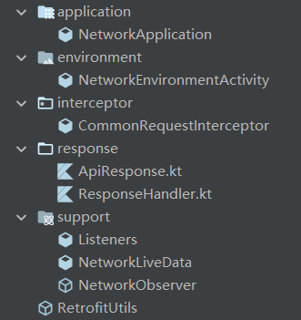

## 支持功能
不同网络环境(正式环境、测试环境)切换、单App中多个域名存在时请求(创建多个RetrofitUtils的子类)
## 网络库结构

1. NetworkApplication：用于获取Application，网络环境切换时需要使用。App的Application需要继承它。
2. NetworkEnvironmentActivity：网络环境配置的Activity，可以切换正式环境、测试环境，通过`NetworkEnvironmentActivity.getNetworkEnvironmentFromSP(applicationContext)`获取当前环境。如果还需要其它环境，需要配置network模块下res/values/arrays.xml中的entries和values。通过`NetworkEnvironmentActivity.startEnvironmentActivity(this)`打开当前Activity。
3. CommonRequestInterceptor：公共拦截器，具体需要根据服务端配置公共Header。
4. ApiResponse：网络请求返回的模板{code，data，message}，isSuccessful的内容需要根据业务修改。
5. ResponseHandler：处理Http和业务状态的类。外部通过handleHttp使用。
6. Listeners、NetworkLiveData、NetworkObserver：用于网络请求返回值封装的LiveData、Observer，便于在外部使用。
7. RetrofitUtils：网络请求的实际类，通过继承实现getBaseUrl()，也可以通过getInterceptor()实现额外的拦截器。
## 具体使用
1. Application继承NetworkApplication。
2. ARetrofitUtils继承RetrofitUtils，实现getBaseUrl()。
3. 实现model类Model。
4. 创建接口，使用协程方式。
```Kotlin
	interface B{
		@GET("test")
		suspend fun test():ApiResponse<Model>
	}
```
5. Repo层(根据业务逻辑判断是否省略)
```Kotlin
	class Repo{
		// 获取service
	
		suspend fun test():ApiResponse<Model>{
			return handleHttp{
				// 调用service对应的函数
			}
		}
	}
```
6. ViewModel层
```Kotlin
	class CViewModel:ViewModel(){
		// 获取Repo
		
		val liveData = NetworkLiveData<Model>()
		
		fun test(){
			viewModelScope.launch{
				liveData.value = // repo获取的值
			}
		}
	}
```
7. 在Activity或者Fragment中调用
